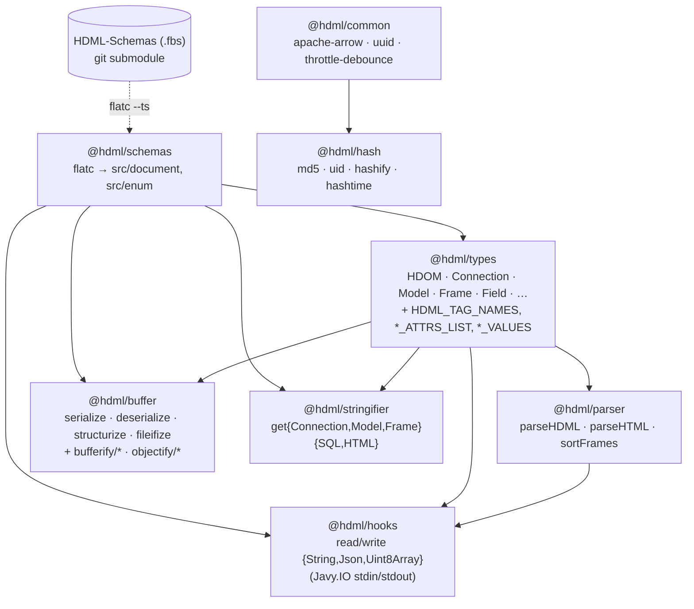
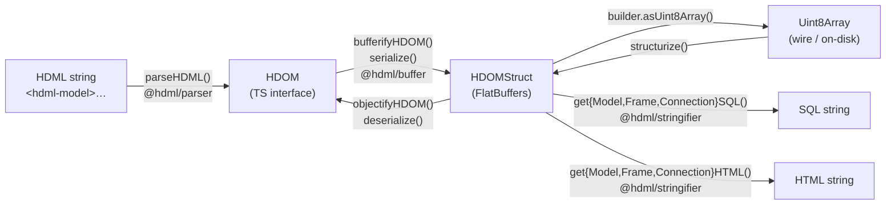

# Architecture

> **Scope:** Map the eight packages, how they depend on each other, and the data-flow
> pipelines they compose (parse → bufferify → serialize → … → stringify). Use this when you
> need to understand the *shape* of the repo before touching code.

## What this monorepo produces

Eight npm packages under the `@hdml/*` scope, published to the public npm registry. They are
the shared HDML "brain": one TypeScript codebase that parses HDML markup, converts it to a
typed object model, serializes it to FlatBuffers, and generates SQL/HTML from it. The same
code runs in **three hosts** — the browser (via `HDML-Components`), the HDIO Javy plugin
(`hdio.wasm`, embedded in `HDIO-Server`), and Node consumers.

The schema contract is owned by **`HDML-Schemas`** (a git submodule at [HDML-Schemas/](../HDML-Schemas)),
not by this repo. `@hdml/schemas` regenerates TypeScript bindings from `*.fbs` at build time
with `flatc`.

## Package dependency graph



Independent leaves: `@hdml/common`, `@hdml/hash`. The HDML-aware packages all sit on
`@hdml/schemas` + `@hdml/types`. `@hdml/hooks` is the WASM I/O layer and depends on the
parser to round-trip strings.

## The HDML data model (concept)

The root object is **HDOM** (HyperData Object Model — [packages/types/src/HDOM.ts:49](../packages/types/src/HDOM.ts#L49)):

```ts
interface HDOM {
  connections: Connection[]; // BigQuery/JDBC/Snowflake/Mongo/ES/GoogleSheets/…
  models: Model[];          // tables + joins + fields
  frames: Frame[];          // SELECT-like queries over a model or another frame
}
```

The HDML tag vocabulary lives in [packages/types/src/enums/HDML_TAG_NAMES.ts](../packages/types/src/enums/HDML_TAG_NAMES.ts):
`hdml-connection`, `hdml-model`, `hdml-table`, `hdml-join`, `hdml-frame`,
`hdml-field`, `hdml-filter-by`, `hdml-connective`, `hdml-filter`, `hdml-group-by`,
`hdml-split-by`, `hdml-sort-by`.

## End-to-end pipeline



Key invariant: **stringifiers consume FlatBuffers structs, not TS interfaces**.
`getModelSQL(model: ModelStruct, …)`, `getFrameSQL(frame: FrameStruct, …)`,
`getConnectionSQLs(conn: ConnectionStruct)` — see
[packages/stringifier/src/connection.ts:25](../packages/stringifier/src/connection.ts#L25),
[packages/stringifier/src/model.ts:24](../packages/stringifier/src/model.ts#L24),
[packages/stringifier/src/frame.ts:17](../packages/stringifier/src/frame.ts#L17). A consumer
that has only a TS `HDOM` must bufferify first.

## Five high-level buffer operations

[packages/buffer/src/index.ts](../packages/buffer/src/index.ts) exports five functions plus
the `StructType` enum:

| Function | Direction | Notes |
|---|---|---|
| `serialize(data, type?)` | TS → bytes | Switches on [StructType](../packages/buffer/src/StructType.ts) (`HDOMStruct`, `ConnectionStruct`, `ModelStruct`, `FrameStruct`, `FileStatusesStruct`); defaults to `HDOMStruct`. |
| `deserialize(bytes, type?)` | bytes → TS | Calls `structurize` then the matching `objectify*`. |
| `structurize(bytes, type?)` | bytes → FlatBuffers struct | Returns the struct (not the TS object). Used by stringifiers. |
| `fileifize(hdom)` | HDOM → `DocumentFilesStruct` bytes | Splits HDOM into per-connection / per-model / per-frame `FileStruct` entries; used by HDIO's compile pipeline. |
| `StructType` (enum) | — | Selector for `serialize` / `deserialize` / `structurize`. |

The `bufferify/` and `objectify/` directories contain the per-node converters that the five
top-level functions call. They are exported transitively through the high-level functions —
direct imports from `bufferify/` / `objectify/` are an internal use only.

## Parsing

[parseHDML](../packages/parser/src/parseHDML.ts) uses parse5 with a custom tree adapter
([hdmlTreeAdapter](../packages/parser/src/hdmlTreeAdapter/hdmlTreeAdapter.ts)) that recognizes
the `hdml-*` tags and accumulates `HDDMData` on each element. The fragment root holds an
accumulator (`rootNode.hddm`) and `parseHDML` lifts it out, then runs
[sortFrames](../packages/parser/src/sortFrames.ts) to order frames in a dependency-safe
sequence (model-rooted before frame-rooted; absolute `/path?hdml-model=…` before local
`?hdml-model=…`).

[parseHTML](../packages/parser/src/parseHTML.ts) is a thin wrapper over `node-html-parser`
with HDML-friendly options (`lowerCaseTagName: false`, comments off, custom void-tag list).

## Stringification

Each `get*SQL` walks the FlatBuffers struct and emits indented SQL using a single
2-space indent constant (`t` in [packages/stringifier/src/constants.ts](../packages/stringifier/src/constants.ts)).

- **Connection** — emits `show catalogs like …` / `drop catalog …` / `create catalog … using <connector> with (…)`. Per-connector parameter blocks for `postgresql`, `mysql`, `mssql`, `oracle`, `clickhouse`, `druid`, `ignite`, `redshift`, `mariadb`, `bigquery`, `googlesheets`, `elasticsearch`, `mongodb`, `snowflake`.
- **Model** — emits `with <tables as CTEs> select <table.field as table_field …> from <joins or plain from>`. Joins are sorted via `sortJoins`.
- **Frame** — emits `with "<source>" as (…) select … from "<source>" [where …] [group by …] [order by …] offset N limit N`. Operates over a `from: { name, sql }` upstream descriptor so frames can chain.

The `getConnectionHTML` / `getModelHTML` / `getFrameHTML` siblings emit the equivalent
markup using `HDML_TAG_NAMES` and `*_ATTRS_LIST` constants from `@hdml/types`.

## WASM I/O hooks

[@hdml/hooks](../packages/hooks/src/index.ts) is the I/O surface for the Javy/QuickJS runtime
inside `hdio.wasm`. All six functions use `Javy.IO.readSync` / `Javy.IO.writeSync` on file
descriptors 0/1/2 (stdin/stdout/stderr), declared in
[packages/hooks/src/types/global.ts](../packages/hooks/src/types/global.ts):

```ts
declare global {
  const Javy: {
    IO: {
      readSync: (fd: number, buffer: Uint8Array) => number;
      writeSync: (fd: number, buffer: Uint8Array) => number;
    };
  };
}
```

The Go host (HDIO-Server) wires its own files to those fds when running predefined modules
(`hdml_parser.wasm`, `hdml_compiler.wasm`). See [docs/integration.md](integration.md) for the
ABI as enforced by the host.

## globalThis side-effects (every entry point)

Every `index.ts` (except `@hdml/types`) writes its exports to `globalThis["@hdml/<name>"]` as
a side-effect of import. Pattern:

```ts
const _export = globalThis as unknown as {
  "@hdml/parser": { parseHDML: typeof parseHDML; … };
};
_export["@hdml/parser"] = { parseHDML, parseHTML, sortFrames };
```

This is **not optional** — `HDIO-Javy-Plugin` rewrites tenant-hook imports of `@hdml/*` into
`globalThis["@hdml/<name>"].fn` lookups, and the hooks fail at runtime if the side-effect
didn't fire. See [docs/decisions.md](decisions.md) for the rationale.

## Source-tree shape

See [docs/development.md#repo-layout](development.md#repo-layout). Per-package internals are
in [docs/packages.md](packages.md).
