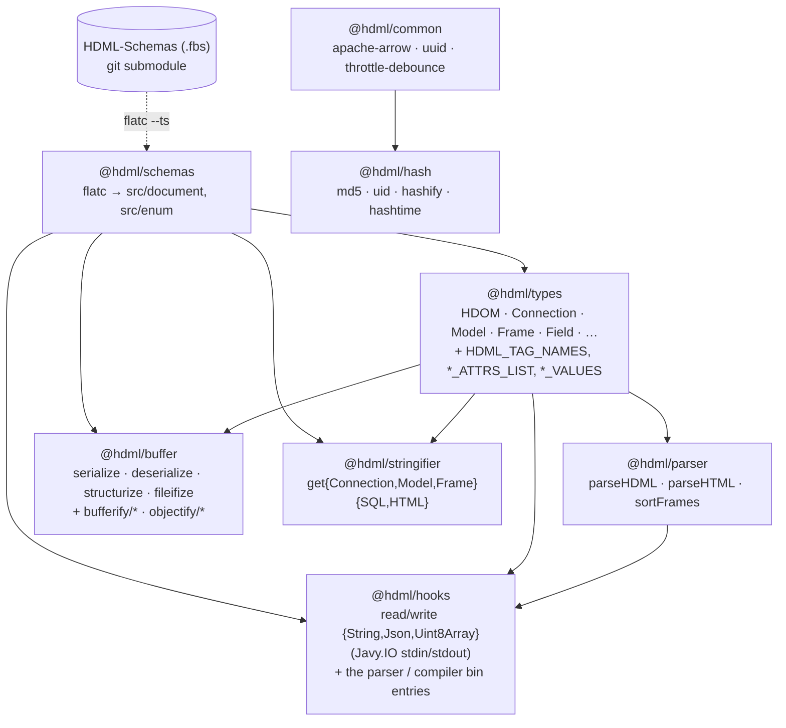
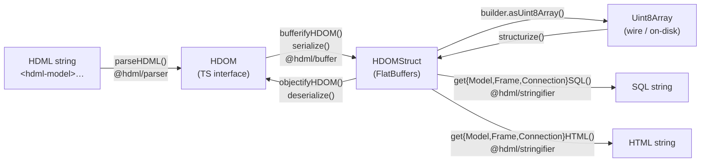

# Architecture

> **Scope:** Map the eight packages, how they depend on each other, and the data-flow
> pipelines they compose (parse → bufferify → serialize → … → stringify). Use this when you
> need to understand the *shape* of the repo before touching code.

## What this monorepo produces

Eight npm packages under the `@hdml/*` scope, published to the public npm registry. They are
the shared HDML "brain": one TypeScript codebase that parses HDML markup, converts it to a
typed object model, serializes it to FlatBuffers, and generates SQL/HTML from it. The same
code runs in **three hosts** — the browser (via `HDML-Components`), the HDIO Javy plugin
(`hdio.wasm`, embedded in `HDIO-Server`), and Node consumers.

The schema contract is owned by **`HDML-Schemas`** (a git submodule at [HDML-Schemas/](../HDML-Schemas)),
not by this repo. `@hdml/schemas` regenerates TypeScript bindings from `*.fbs` at build time
with `flatc`.

## Package dependency graph


```mermaid
flowchart TD
    fbs[("HDML-Schemas (.fbs)<br/>git submodule")]
    schemas["@hdml/schemas<br/>flatc → src/document, src/enum"]
    common["@hdml/common<br/>apache-arrow · uuid · throttle-debounce"]
    hash["@hdml/hash<br/>md5 · uid · hashify · hashtime"]
    types["@hdml/types<br/>HDOM · Connection · Model · Frame · Field · …<br/>+ HDML_TAG_NAMES, *_ATTRS_LIST, *_VALUES"]
    parser["@hdml/parser<br/>parseHDML · parseHTML · sortFrames"]
    buffer["@hdml/buffer<br/>serialize · deserialize · structurize · fileifize<br/>+ bufferify/* · objectify/*"]
    stringifier["@hdml/stringifier<br/>get{Connection,Model,Frame}{SQL,HTML}"]
    hooks["@hdml/hooks<br/>read/write {String,Json,Uint8Array}<br/>(Javy.IO stdin/stdout)<br/>+ the parser / compiler bin entries"]

    fbs -. "flatc --ts" .-> schemas
    schemas --> types
    schemas --> buffer
    schemas --> stringifier
    schemas --> hooks
    types --> parser
    types --> buffer
    types --> stringifier
    types --> hooks
    parser --> hooks
    common --> hash
```

Independent leaves: `@hdml/common`, `@hdml/hash`. The HDML-aware packages all sit on
`@hdml/schemas` + `@hdml/types`. `@hdml/hooks` is the WASM I/O layer and depends on the
parser to round-trip strings.

## The HDML data model (concept)

The root object is **HDOM** (HyperData Object Model — [packages/types/src/HDOM.ts:49](../packages/types/src/HDOM.ts#L49)):

```ts
interface HDOM {
  connections: Connection[]; // BigQuery/JDBC/Snowflake/Mongo/ES/GoogleSheets/…
  models: Model[];          // tables + joins + fields
  frames: Frame[];          // SELECT-like queries over a model or another frame
}
```

The HDML tag vocabulary lives in [packages/types/src/enums/HDML_TAG_NAMES.ts](../packages/types/src/enums/HDML_TAG_NAMES.ts)
— **34 members in one flat enum**, in two halves. The **twelve data tags**
(HDQL) are the ones this repo parses, serializes and stringifies:
`hdml-connection`, `hdml-frame`, `hdml-model`, `hdml-dataset`, `hdml-join`,
`hdml-connective`, `hdml-filter-by`, `hdml-filter`, `hdml-group-by`,
`hdml-split-by`, `hdml-sort-by`, `hdml-field`. The **twenty-two display tags**
(HDVL) are vocabulary only here — `@hdml/components` implements them — and the
enum carries them so one source names the whole language.

> **`hdml-dataset`, not `hdml-table`.** The tag, `DATASET_ATTRS_LIST` and
> `DATASET_TYPE_VALUES` were renamed at 019 step 07. The TS interface is still
> `Table`, the struct is still `TableStruct`, the enum is still `TableTypeEnum`
> and the tree-adapter handler is still `getTableData` — renaming those is a
> `.fbs` change and is deliberately **not** part of the vocabulary rename.
> So *tag* `hdml-dataset` ↔ *type* `Table` is expected, not drift.

A model field also carries a **`key`** — `hdml-field@key`, `Field.key:
null | string`, the named key group the field belongs to (`"pk"`, an alternate
unique key, …). It is a **string rather than a boolean** because a key is a
*set*: a boolean cannot tell one column of a composite primary key from an
alternate unique key. `key` is legal only on a field directly inside an
`hdml-dataset`; in the other four positions the parser reports
`misplaced-key`, the 11th `HDQL_DIAGNOSTIC_CODES` member.

### The display half is vocabulary, and 019 moved some of it into CSS

The 22 display tags and their 21 `*_ATTRS_LIST` enums are **names only** in this
repo — nothing here parses, serializes or stringifies them; `@hdml/components`
implements them. Three of 019's changes therefore land here as pure vocabulary
edits with no reader in this monorepo:

- **`count` and `format` left the vocabulary** (step 16, items 18 + 19).
  `TICK_`, `GRID_`, `LABEL_` and `LEGEND_ATTRS_LIST` go **18 → 12** members;
  both attributes are now registered CSS properties (`--hdml-tick-count`,
  `--hdml-text-format`), because how many ticks a guide draws and how a label
  formats a value are appearance, not data. **Breaking** — hence
  `0.0.2-alpha.26` rather than a patch. ⚠ Not to be confused with
  `AGGREGATION_VALUES.COUNT`, the `count` *value* of `hdml-field@aggregation`,
  which is untouched.
- **`hdml-text` joined as the 25th tag** (step 14), inserted with the marks
  after `hdml-rule`, and **50 `initial-{slot}` members** joined the ten mark
  enums (step 15), taking them to **116** members. Both ship with no reader
  for one publish; the consumers are steps 41 and 43, in `@hdml/components`.

★ **The asymmetry is the point**: this repo is where the whole language is
*named*, and only the data half is where it is *executed*.

## End-to-end pipeline


```mermaid
flowchart LR
    src["HDML string<br/>&lt;hdml-model&gt;…"]
    hdom["HDOM<br/>(TS interface)"]
    fbs_struct["HDOMStruct<br/>(FlatBuffers)"]
    bytes["Uint8Array<br/>(wire / on-disk)"]
    sql["SQL string"]
    htmlOut["HTML string"]

    src -- "parseHDML()<br/>@hdml/parser" --> hdom
    hdom -- "bufferifyHDOM()<br/>serialize()<br/>@hdml/buffer" --> fbs_struct
    fbs_struct -- "builder.asUint8Array()" --> bytes
    bytes -- "structurize()" --> fbs_struct
    fbs_struct -- "objectifyHDOM()<br/>deserialize()" --> hdom
    fbs_struct -- "get{Model,Frame,Connection}SQL()<br/>@hdml/stringifier" --> sql
    fbs_struct -- "get{Model,Frame,Connection}HTML()<br/>@hdml/stringifier" --> htmlOut
```

Key invariant: **stringifiers consume FlatBuffers structs, not TS interfaces**.
`getModelSQL(model: ModelStruct, …)`, `getFrameSQL(frame: FrameStruct, …)`,
`getConnectionSQLs(conn: ConnectionStruct)` — see
[packages/stringifier/src/connection.ts:25](../packages/stringifier/src/connection.ts#L25),
[packages/stringifier/src/model.ts:24](../packages/stringifier/src/model.ts#L24),
[packages/stringifier/src/frame.ts:17](../packages/stringifier/src/frame.ts#L17). A consumer
that has only a TS `HDOM` must bufferify first.

## Five high-level buffer operations

[packages/buffer/src/index.ts](../packages/buffer/src/index.ts) exports five functions plus
the `StructType` enum:

| Function | Direction | Notes |
|---|---|---|
| `serialize(data, type?)` | TS → bytes | Switches on [StructType](../packages/buffer/src/StructType.ts) (`HDOMStruct`, `ConnectionStruct`, `ModelStruct`, `FrameStruct`, `FileStatusesStruct`); defaults to `HDOMStruct`. |
| `deserialize(bytes, type?)` | bytes → TS | Calls `structurize` then the matching `objectify*`. |
| `structurize(bytes, type?)` | bytes → FlatBuffers struct | Returns the struct (not the TS object). Used by stringifiers. |
| `fileifize(hdom)` | HDOM → `DocumentFilesStruct` bytes | Splits HDOM into per-connection / per-model / per-frame `FileStruct` entries; used by HDIO's compile pipeline. |
| `StructType` (enum) | — | Selector for `serialize` / `deserialize` / `structurize`. |

The `bufferify/` and `objectify/` directories contain the per-node converters that the five
top-level functions call. They are exported transitively through the high-level functions —
direct imports from `bufferify/` / `objectify/` are an internal use only.

## Parsing

[parseHDML](../packages/parser/src/parseHDML.ts) uses parse5 with a custom tree adapter
([hdmlTreeAdapter](../packages/parser/src/hdmlTreeAdapter/hdmlTreeAdapter.ts)) that recognizes
the `hdml-*` tags and accumulates `HDDMData` on each element. The fragment root holds an
accumulator (`rootNode.hddm`) and `parseHDML` lifts it out, then runs
[sortFrames](../packages/parser/src/sortFrames.ts) to order frames in a dependency-safe
sequence (model-rooted before frame-rooted; absolute `/path?hdml-model=…` before local
`?hdml-model=…`).

[parseHTML](../packages/parser/src/parseHTML.ts) is a thin wrapper over `node-html-parser`
with HDML-friendly options (`lowerCaseTagName: false`, comments off, custom void-tag list).

## Stringification

Each `get*SQL` walks the FlatBuffers struct and emits indented SQL using a single
2-space indent constant (`t` in [packages/stringifier/src/constants.ts](../packages/stringifier/src/constants.ts)).

- **Connection** — emits `show catalogs like '…'` / `drop catalog "…"` / `create catalog "…" using <connector> with (…)`. The catalog name is double-quoted where it is an identifier (`drop`/`create`) so hyphenated `{tenant}_{conn}` names are valid Trino identifiers. Per-connector parameter blocks for `postgresql`, `mysql`, `mssql`, `oracle`, `clickhouse`, `druid`, `ignite`, `redshift`, `mariadb`, `bigquery`, `googlesheets`, `elasticsearch`, `mongodb`, `snowflake`.
- **Model** — emits `with <tables as CTEs> select <table.field as table_field …> from <joins or plain from>`. Joins are sorted via `sortJoins`.
- **Frame** — emits `with "<source>" as (…) select … from "<source>" [where …] [group by …] [order by …] offset N limit N`. Operates over a `from: { name, sql }` upstream descriptor so frames can chain.

The `getConnectionHTML` / `getModelHTML` / `getFrameHTML` siblings emit the equivalent
markup using `HDML_TAG_NAMES` and `*_ATTRS_LIST` constants from `@hdml/types`.

## WASM I/O hooks

[@hdml/hooks](../packages/hooks/src/index.ts) is the I/O surface for the Javy/QuickJS runtime
inside `hdio.wasm`. All six functions use `Javy.IO.readSync` / `Javy.IO.writeSync` on file
descriptors 0/1/2 (stdin/stdout/stderr), declared in
[packages/hooks/src/types/global.ts](../packages/hooks/src/types/global.ts):

```ts
declare global {
  const Javy: {
    IO: {
      readSync: (fd: number, buffer: Uint8Array) => number;
      writeSync: (fd: number, buffer: Uint8Array) => number;
    };
  };
}
```

The Go host (HDIO-Server) wires its own files to those fds when running predefined modules
(`hdml_parser.wasm`, `hdml_compiler.wasm`). See [docs/integration.md](integration.md) for the
ABI as enforced by the host.

### The two bin entries, and why they echo the plugin version

`@hdml/hooks` also ships the **module bodies** those two `.wasm` files are built
from — [`src/parser.ts`](../packages/hooks/src/parser.ts) and
[`src/compiler.ts`](../packages/hooks/src/compiler.ts), bundled to
`bin/{parser,compiler}.min.js` by `compile_bin`. Each is a **top-level IIFE**:
it `readJson()`s its input, computes, and `writeJson()`s its envelope, all at
module scope, so *importing* one runs it. Neither resolves `@hdml/*` through a
TS import — both destructure the real functions off `globalThis`, which the
Javy plugin populates — so a broken `hdio-javy-core` link throws at `_start`
instead of silently importing nothing.

Both entries now set **`plugin: globalThis["@hdml/version"]`** on the envelope
they write (019 step 16, A4; RFC 019/002 §4.6). The reason is that a
predefined module's import surface carries **no version and no hash**: it
imports exactly `hdio-javy-core::{cabi_realloc, invoke, memory}`, and the
plugin's only identity marker is a custom wasm section holding the bare string
`hdio-javy-core`. A module built against one plugin and run against another
therefore binds to the *running* plugin's globals, with no instantiate error
and byte-identical output — measured. The echo is what makes the pairing
legible; HDIO-Server embeds its `.fetched-version` marker and compares.

- ⚠ The **field** is `plugin`; the **global** is `@hdml/version`. The names
  differ on purpose — Go reads `json:"plugin,omitempty"`.
- ★ It is set at the **bin entry**, wrapping whatever came back, not inside
  `buildManifest` or the `compile*` branches. Those have nine-plus return
  sites and most of them are errors, and a skewed plugin that *fails* is
  exactly the case worth versioning — so one site per entry covers every shape.
- An absent global leaves the field `undefined`, which `JSON.stringify` drops.
  That is the `omitempty` the Go side expects, and it is what an older plugin
  produces.

## globalThis side-effects (every entry point)

Every `index.ts` (except `@hdml/types`) writes its exports to `globalThis["@hdml/<name>"]` as
a side-effect of import. Pattern:

```ts
const _export = globalThis as unknown as {
  "@hdml/parser": { parseHDML: typeof parseHDML; … };
};
_export["@hdml/parser"] = { parseHDML, parseHTML, sortFrames };
```

This is **not optional** — `HDIO-Javy-Plugin` rewrites tenant-hook imports of `@hdml/*` into
`globalThis["@hdml/<name>"].fn` lookups, and the hooks fail at runtime if the side-effect
didn't fire. See [docs/decisions.md](decisions.md) for the rationale.

## Source-tree shape

See [docs/development.md#repo-layout](development.md#repo-layout). Per-package internals are
in [docs/packages.md](packages.md).
