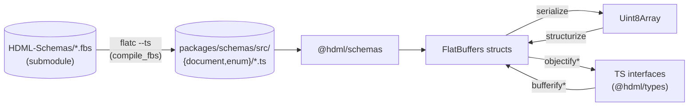

# Schemas — FlatBuffers contract and codegen

> **Scope:** Where the wire/on-disk format comes from, how it is generated for each
> consumer, and what changes when you edit a `.fbs` file. Open this when modifying the
> FlatBuffers schema or debugging a serialization mismatch.

## Source of truth

The `.fbs` files live in a **separate repository** — [HDML-Foundation/HDML-Schemas](https://github.com/HDML-Foundation/HDML-Schemas) — vendored into this repo as a
**git submodule** at [HDML-Schemas/](../HDML-Schemas) ([.gitmodules](../.gitmodules)). This
repo does **not** modify `.fbs` files; it consumes them.

The root envelope type is **`HDOM`** (HyperData Object Model). Other top-level structs:
`Connection`, `Model`, `Frame`, `Field`, `Join`, `Include`, `FilterClause`, plus type-options
and per-connector parameter structs. The full list of generated TypeScript bindings is
re-exported from [packages/schemas/src/index.ts](../packages/schemas/src/index.ts) — that
file is the authoritative roster of what the schema currently defines.

## flatc version

**`flatc` v24.3.25**, pinned in the workspace devcontainer Dockerfile (`.devcontainer/Dockerfile`
at the workspace root). All generated bindings — TS here, Go in `HDIO-Server` — must come from
the same `flatc` version or the wire format will drift.

## TypeScript binding generation

Triggered by `compile_fbs` in [packages/schemas/package.json](../packages/schemas/package.json):

```bash
flatc --ts --ts-omit-entrypoint \
  -o ./src \
  -I ../../HDML-Schemas/src \
  ../../HDML-Schemas/src/*.fbs
```

This populates two directories under `packages/schemas/src/`:

- `document/` — generated table/struct classes (e.g. `hdomstruct.ts`, `model-struct.ts`,
  `connection-struct.ts`, `field-struct.ts`, …).
- `enum/` — generated enum modules (e.g. `connector-types-enum.ts`,
  `aggregation-type-enum.ts`, …).

Both directories are **gitignored** ([.gitignore](../.gitignore)) — they are build outputs,
not source. `compile_fbs` runs automatically as part of `npm -w @hdml/schemas run build`,
before lint.

After regeneration, [packages/schemas/src/index.ts](../packages/schemas/src/index.ts) is the
single re-export surface. If you add a new struct to a `.fbs`, you must also add it to that
index.

## Round-trip flow



`@hdml/types` defines hand-authored TS interfaces (`HDOM`, `Connection`, `Model`, `Frame`,
`Field`, `Filter`, `Join`, `Table`, `Include`) that mirror the FlatBuffers structs. They are
the ergonomic shape for callers; the structs are the wire shape.

## DocumentFiles packaging

[fileifize](../packages/buffer/src/fileifize.ts) wraps an `HDOM` as a
`DocumentFilesStruct` — one `FileStruct` entry per connection / model / frame, each with
its own serialized payload. This is the format HDIO-Server writes to disk (`usr/{tenant}/bin/…`)
during the compile pipeline. The reverse direction is not a single `objectify` — callers
extract each `FileStruct.buffer()` and call `structurize(buffer, StructType.<Connection|Model|Frame>Struct)`.

A sibling `DocumentFileStatusesStruct` carries per-file status (parallel arrays
`names`/`statuses`/`messages`); see the [FileStatuses](../packages/buffer/src/FileStatuses.ts)
type and `StructType.FileStatusesStruct = 5`.

## Changing a `.fbs`

Schema changes are **breaking** for every binding. Order:

1. Edit `HDML-Schemas/src/*.fbs` (in the submodule — that's its own repo and own PR).
2. Bump the submodule pointer in this repo (`git add HDML-Schemas` after `git -C HDML-Schemas
   checkout <sha>`).
3. Regenerate TS: `npm -w @hdml/schemas run compile_fbs` (or `build`).
4. Re-export the new symbol(s) from [packages/schemas/src/index.ts](../packages/schemas/src/index.ts).
5. Update [packages/types/](../packages/types/src/) interfaces and enum constants if the
   shape changed.
6. Update `bufferify*` / `objectify*` in [@hdml/buffer](../packages/buffer/src/).
7. Update stringifier emitters if a new attribute/tag was added.
8. Update parser tree-adapter handlers if a new tag was added.
9. Re-publish `@hdml/*` at a new lockstep version.
10. Downstream: `HDIO-Server` regenerates Go bindings (`scripts/run_fbs.sh`); the Javy
    plugin bumps its `.hdml/` deps and rebuilds `hdio.wasm`. See [integration.md](integration.md).

## flatbuffers (runtime)

The `flatbuffers` npm package at version **24.3.25** is the runtime support library — it
must match `flatc`'s version. Pinned in every consuming package's `dependencies`.
